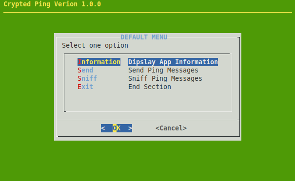
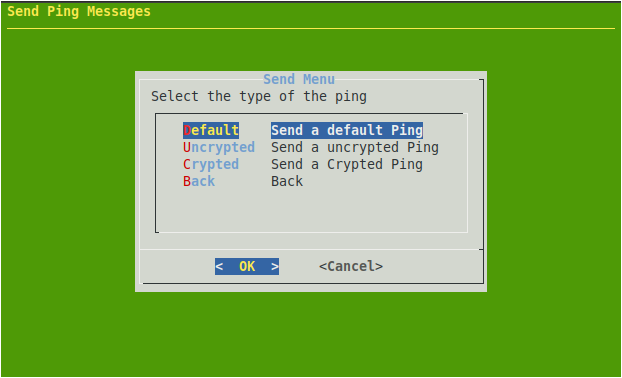
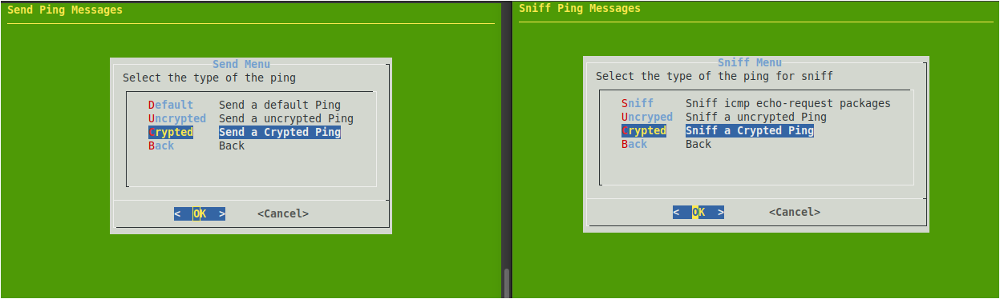
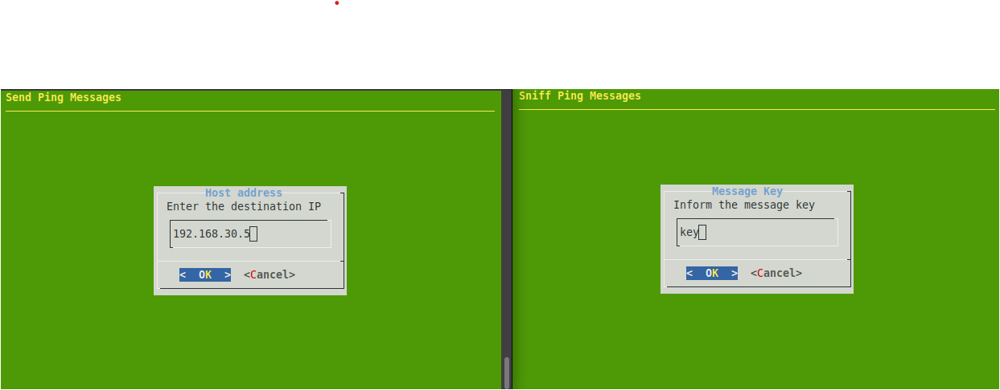
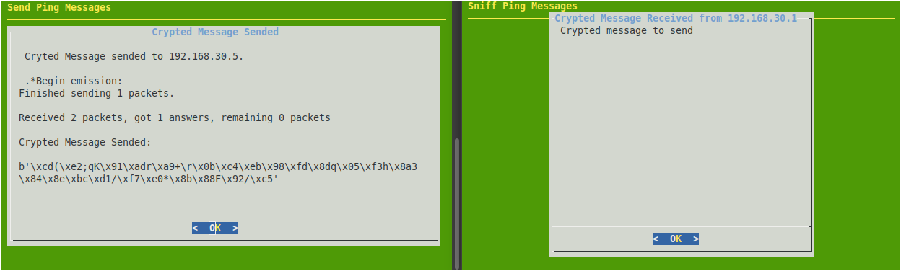

# How to send message with ICMP (ping)  protocol.

## The Advanced Example of The Shell Script Dialog And Python3

## Who it Works

### 

This app send messages in the boby of the ICMP packeges echo-resquest and echo-replay.
This messages can be send in clear text or cryptografed with SHA256.













# How to Install it
## Basics packages Installed

```
sudo apt install dialog
sudo apt install zip
```

## Optionals packages
```
sudo apt install -y iptables
sudo apt install -y iptables-persistent
sudo apt install -y apache2

```


## Download the files and extract it
```

wget https://github.com/KeystoneDevBr/app_dialog.d/archive/refs/heads/main.zip

unzip main.zip 


```
### Copy the files for directory /etc/profile.d

```
#Copy the app folder for your directory /etc/profile.d/ 
sudo mv app_dialog.d-main/ /etc/profile.d/app_dialog.d/

#Copy the start file for your directory /etc/profile.d/
sudo cp /etc/profile.d/app_dialog.d/dialog.sh  /etc/profile.d/

#Check if the  index.sh exists in the app folder 
ls -la  /etc/profile.d/app_dialog.d/dialog.d/index.sh

#Check if start file is is pointing correctly to index.sh file
sudo vim /etc/profile.d/dialog.sh

```

You neet see something like this


```
#!/bin/bash
#Start the dialog afet all user login

path_app="/etc/profile.d/app_dialog.d/dialog.d"

bash "$path_app/index.sh"

```

The struture the file needs to be like this:

```
/etc/profile.d/dialog.sh
/etc/profile.d/app_dialog.d/dialog.d/index.sh
/etc/profile.d/app_dialog.d/dialog.d/f_apache.sh
/etc/profile.d/app_dialog.d/dialog.d/f_config_ip.sh
/etc/profile.d/app_dialog.d/dialog.d/f_iptables.sh
/etc/profile.d/app_dialog.d/dialog.d/f_mysql.sh
/etc/profile.d/app_dialog.d/dialog.d/f_netplan_apply.sh
/etc/profile.d/app_dialog.d/dialog.d/f_vm_information.sh


```

### Change the owner of files for root

```
sudo chown root.$USER -R /etc/profile.d/app_dialog.d/ /etc/profile.d/dialog.sh

```

### Turn all files executable

```
sudo chmod 775 -R  /etc/profile.d/dialog.sh /etc/profile.d/app_dialog.d/

```

### Exit and start a new section
```
exit


ssh  <cliente_name>@<server_address>

```
```
